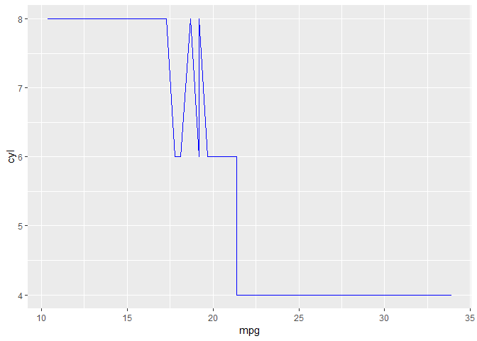

R Notebook
================

``` r
library(tidyverse)
```

Este é meu primeiro relatório onde eu:

*crio um plot *e me despido

``` r
mtcars %>% 
  ggplot (aes (mpg,cyl))+
  geom_line(color="blue")
```


